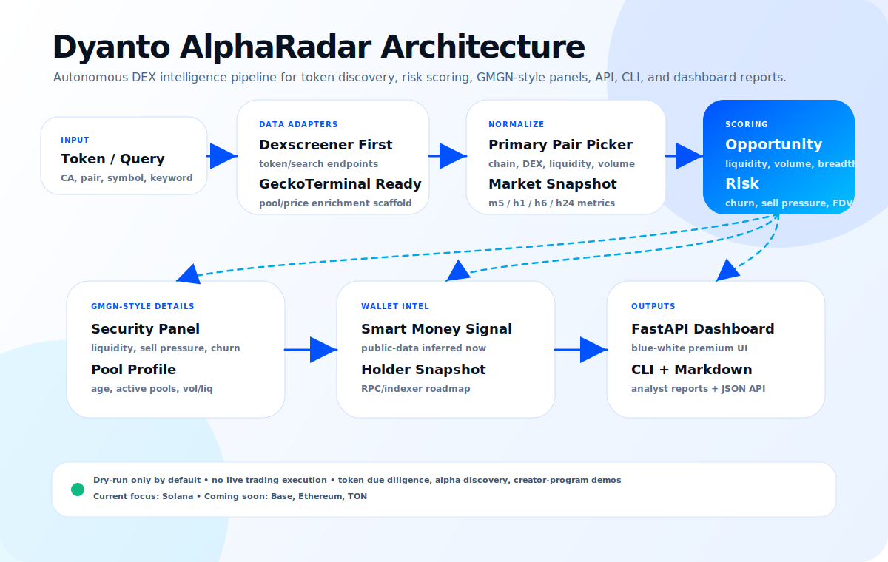

# Dyanto AlphaRadar

Autonomous crypto market intelligence agent for Solana memecoins and DEX opportunities.

Dyanto AlphaRadar turns token addresses, pairs, or market keywords into structured intelligence reports: live market structure, opportunity/risk score, GMGN-inspired detail panels, narrative hints, verdict, and dry-run action ideas.



## Why this project exists

Dyanto AlphaRadar was built as a serious agentic AI showcase, not a basic chatbot. The goal is to demonstrate an autonomous workflow that can collect live crypto market data, normalize messy DEX responses, score opportunity and risk, and produce an analyst-style output that traders can actually read.

The project is designed for creator-program demos around modern open AI models such as Xiaomi MiMo-style long-context and tool-use agents. It highlights the kind of work an AI agent should do well:

- use external tools and APIs
- handle incomplete market data
- combine multiple signals into a useful decision layer
- explain why a token looks interesting or dangerous
- produce structured output through CLI, API, dashboard, and Markdown reports

## Core idea

Input a token contract address, pair address, symbol, or search keyword. Dyanto AlphaRadar then:

1. Fetches live DEX data.
2. Selects the most relevant primary pair by practical liquidity.
3. Normalizes price, liquidity, volume, transactions, FDV, age, and timeframe metrics.
4. Scores opportunity and risk.
5. Builds GMGN-inspired security, pool, smart-money, holder, and timeframe panels.
6. Extracts available narrative/social metadata.
7. Classifies the token movement as Organic, Coordinated, Manipulated, Mixed, or Monitor.
8. Returns a dashboard view, JSON response, CLI output, and Markdown report.

## Current feature set

### Data collection

- Dexscreener token endpoint
- Dexscreener search fallback
- GeckoTerminal adapter scaffold
- Solana-first pair selection
- Multiple-pair awareness
- Timeframe metric normalization: 5m, 1h, 6h, 24h

### Market scoring

Opportunity score uses:

- liquidity depth
- volume/liquidity turnover
- transaction breadth
- buy pressure
- momentum
- valuation turnover

Risk score uses:

- thin liquidity
- overheated volume/liquidity churn
- seller dominance
- parabolic move on shallow liquidity
- low liquidity/FDV support
- short-term reversal pressure

Labels:

- HOT
- WARM+
- WARM
- MONITOR
- RISKY
- AVOID

### GMGN-inspired detail panels

Dyanto AlphaRadar mirrors useful concepts from GMGN-style token analysis without relying on private GMGN APIs.

Security panel:

- liquidity status: thin, healthy, deep
- sell pressure: elevated, balanced, buy-dominant
- churn status from volume/liquidity ratio
- liquidity/FDV support
- unresolved placeholders for honeypot, renounced, and LP burn checks

Pool profile:

- DEX name
- pair address
- pair age
- active pool count
- liquidity
- volume/liquidity ratio
- liquidity/FDV ratio
- pair URL

Timeframe tape:

- 5m price change and volume
- 1h price change, volume, buys, sells
- 6h price change and volume
- 24h price change, volume, buys, sells

Smart money panel:

- public-data inferred smart-money signal
- placeholder for smart_degen count
- placeholder for KOL exposure
- placeholder for fresh wallet risk
- placeholder for sniper risk

Holder/wallet snapshot:

- top holders placeholder
- dev wallet placeholder
- LP/pool authority placeholder
- concentration risk placeholder
- designed for future Solana RPC/indexer enrichment

Research checklist:

- inspect first 70 buyers
- detect sniper, bundler, dev, and fresh-wallet clustering
- separate LP/pool-authority wallets from real insiders
- verify liquidity lock/burn and pool authority
- track smart-money accumulation or distribution
- ignore dust pools when several pools exist

### Outputs

- FastAPI JSON API
- Premium blue-white dashboard UI
- Typer CLI command
- Markdown report renderer
- Demo report under `reports/`
- GitHub Actions CI
- Pytest suite
- Ruff linting

## Screens / visual direction

The dashboard uses a premium fintech-style blue-white theme:

- primary blue: `#0052ff`
- cyan accent: `#00c2ff`
- white glass cards
- radar orb animation
- metric cards
- GMGN-style detail panels
- responsive mobile layout

Run locally and open:

```text
http://127.0.0.1:8787
```

## Architecture

```text
Token / Query
  -> Dexscreener token/search adapter
  -> GeckoTerminal-ready enrichment scaffold
  -> Primary pair selection
  -> Market normalization
  -> Opportunity/risk scoring
  -> GMGN-style enrichment panels
  -> Verdict classification
  -> Dashboard / API / CLI / Markdown report
```

Main modules:

```text
src/dyanto_alpha_radar/
  adapters/dexscreener.py      # Dexscreener fetch + normalization
  adapters/geckoterminal.py    # GeckoTerminal scaffold
  analyzer.py                  # orchestration pipeline
  enrichment.py                # GMGN-inspired detail panels
  scoring.py                   # opportunity/risk scoring
  report.py                    # Markdown report renderer
  cli.py                       # CLI entrypoint
  api.py                       # FastAPI app + dashboard
```

## Install

```bash
git clone https://github.com/dyantogsg-lang/dyanto-alpha-radar.git
cd dyanto-alpha-radar
python3 -m venv .venv
. .venv/bin/activate
pip install -e '.[dev]'
```

## CLI usage

Scan a token or query:

```bash
dyanto-alpha-radar So11111111111111111111111111111111111111112
```

Save Markdown report:

```bash
dyanto-alpha-radar <TOKEN_OR_QUERY> -o reports/example.md
```

Return JSON:

```bash
dyanto-alpha-radar <TOKEN_OR_QUERY> --json
```

Example:

```bash
dyanto-alpha-radar BONK --json
```

## API and dashboard

Start local server:

```bash
uvicorn dyanto_alpha_radar.api:app --reload --host 127.0.0.1 --port 8787
```

Open dashboard:

```text
http://127.0.0.1:8787
```

Health check:

```text
GET /health
```

Scan API:

```text
GET /api/scan?target=<TOKEN_OR_QUERY>
```

Markdown report API:

```text
GET /report?target=<TOKEN_OR_QUERY>
```

Example:

```bash
curl 'http://127.0.0.1:8787/api/scan?target=So11111111111111111111111111111111111111112'
```

## Example JSON shape

```json
{
  "identity": {
    "name": "Wrapped SOL",
    "symbol": "SOL",
    "chain": "solana",
    "address": "So11111111111111111111111111111111111111112"
  },
  "market": {
    "price_usd": 84.53,
    "liquidity_usd": 30290000,
    "volume_24h": 107250000,
    "txns_24h_buys": 16922,
    "txns_24h_sells": 15901
  },
  "score": {
    "opportunity_score": 58.2,
    "risk_score": 25.0,
    "label": "WARM",
    "vol_liq": 3.54,
    "buy_ratio": 0.516
  },
  "details": {
    "security": {},
    "pool": {},
    "timeframes": {},
    "smart_money": {},
    "holder_snapshot": {}
  },
  "verdict": "Mixed"
}
```

## Report sections

Generated Markdown reports include:

- What it is
- Live structure
- Score
- GMGN-style detail panels
- Why it moved / narrative
- Verdict
- Risk flags
- Suggested actions
- Safety mode

## Development

Run tests:

```bash
pytest -q
```

Run lint:

```bash
ruff check src tests
```

Compile check:

```bash
python -m compileall -q src
```

Full local verification:

```bash
pytest -q && ruff check src tests && python -m compileall -q src
```

Smoke test:

```bash
mkdir -p reports
dyanto-alpha-radar So11111111111111111111111111111111111111112 --json > reports/sol-demo.json
dyanto-alpha-radar So11111111111111111111111111111111111111112 -o reports/sol-demo.md
```

## Safety model

Dyanto AlphaRadar is dry-run intelligence software.

It does not execute live trades by default. It is intended for:

- token research
- market monitoring
- risk flagging
- analyst-style reporting
- agent workflow demos

It is not financial advice and should not be treated as an automatic trading system.

## Roadmap

Near-term:

- Solana RPC holder concentration module
- first 70 buyers analysis
- LP/pool authority classifier
- dev wallet detection
- Pump.fun fallback
- GeckoTerminal participant breadth enrichment
- Telegram alert publisher

Mid-term:

- Open WebUI plugin wrapper
- scheduled radar watchlists
- dry-run trade simulator
- wallet-role classifier
- backtest reports
- chart screenshot multimodal analysis

Long-term:

- smart-money wallet database
- token launch chronology builder
- public landing page
- hosted demo
- creator-program demo video
- multi-agent research mode

## Project positioning

Dyanto AlphaRadar sits between a token scanner, a risk engine, and an AI analyst.

Compared with simple DEX dashboards, it aims to produce reasoning-oriented intelligence:

- not just price, but why the structure matters
- not just liquidity, but whether liquidity is fragile
- not just volume, but whether volume/liquidity churn is overheated
- not just holders, but whether wallet roles are actually understood
- not just alerts, but readable reports

## License

MIT
